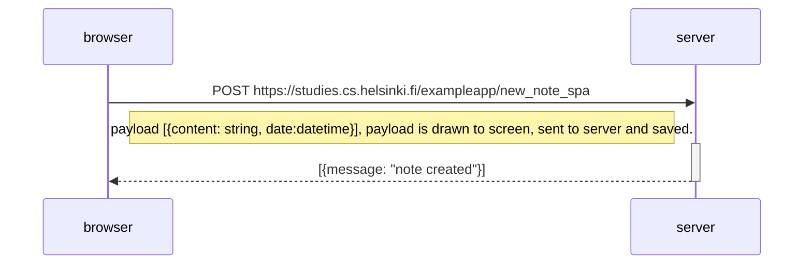

```mermaid
sequenceDiagram
    participant browser
    participant server

    browser->>server: POST https://studies.cs.helsinki.fi/exampleapp/new_note_spa
    Note right of browser: payload [{content: string, date:datetime}], payload is drawn to screen, sent to server and saved.
    activate server
    server-->>browser: [{message: "note created"}]
    deactivate server

```